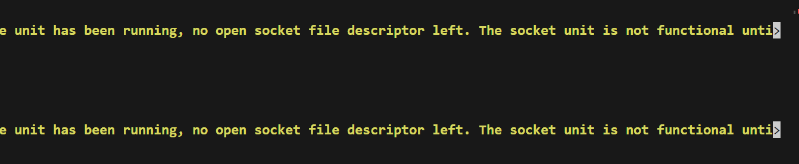

配置阿里云道阻且长。。。

配置ssh，在重启后方可启动

第一步，没有apt-get，只有yum：并且yum的源不对，要配置yum源


然后我在更换操作系统之后，被告知：指纹发生变化，需要重新进入系统，要把known——host删掉重新进入

## 1.2 配置CentOS镜像源

查找到本地linux版本[yum源配置，这一篇就够了！(包括本地，网络，本地共享yum源)_51CTO博客_yum配置yum源](https://blog.51cto.com/u_15070902/6275507)

然后在华为镜像源站上面找到CentOS 7对应的repo，相当于这个版本的额

 wget https://repo.huaweicloud.com/repository/conf/CentOS-7-reg.repo


但是还是不能用yum install apt...

然后docker 在制作容器的时候也有问题。。。


这个好像能解决[runtime/cgo: pthread_create failed: Operation not permitted · Issue #1501 · containers/skopeo (github.com)](https://github.com/containers/skopeo/issues/1501)


## 1.3配置github的host地址

解决思路：修改Host

[https://www.ipaddress.com/](https://cloud.tencent.com/developer/tools/blog-entry?target=https%3A%2F%2Fwww.ipaddress.com%2F&source=article&objectId=1946059)

利用上面的网站查询github.com和raw.githubusercontent.com的DNS解析的IP地址

最后，修改[服务器](https://cloud.tencent.com/act/pro/promotion-cvm?from_column=20065&from=20065)的/etc/hosts

添加如下两行：

```javascript
140.82.112.4 github.com
185.199.108.133 raw.githubusercontent.com
```


## 1.4配置beego

1、目标：在golang镜像的基础上构建含有beego框架的镜像

2、步骤就是：在基础镜像上加一个在github上拉取的beego作为一个最终镜像 ，但是基础镜像一开始是没有git的，所以无法拉取github上的内容，所以才要先把git安装好

3、通过尝试，发现alpine里面安装的是apk，通过apk来管理包：这里的语法是apk add git；

4、同样的。。。只要在国内，都要配置软件镜像源，这里配置为阿里云的模式，轻松搞定~

```dockerfile
FROM golang:1.19-alpine AS BASE

# 设置工作目录
RUN mkdir /home/app 
WORKDIR /home/app
COPY . .

# 设置 GOPROXY 环境变量，这里以 goproxy.cn 为例

ENV GOPROXY=https://goproxy.cn,direct

# 在apk里面是用的apk来管理包，所以用apk来安装 git
#但是在这里也要配置镜像源
RUN sed -i 's/dl-cdn.alpinelinux.org/mirrors.aliyun.com/g' /etc/apk/repositories
RUN apk add --no-cache git
# 获取依赖
RUN go get github.com/beego/beego/v2
```

```bash
docker run -it -d -p 5050:5050 -v /home/root/dockerlab/my-beego-program/:/home/app/ --name=bee-container beego
```


结果发现什么？我发现进入容器之后不能直接使用bee的命令，可能就是没有配置好环境变量，很好笑，我把GOPATH的路径配错啦！/home/root//docker...我这样写的，中间有俩//，所以系统才无法识别，没有办法使用我的GOPATH路径！

然后GOPATH相当于是一个工作目录，首先在工作目录下不能放东西的！！要在他的子目录放：比如

```shell
├── hello
│   ├── pkg
│   └── test
这样一个结构，hello是工作目录，test是我的要写代码的目录，要在这个目录下用go get?
但是很奇怪的是，还是不能直接用bee命令
```


我终于知道为什么我在使用完go intall <beepath>之后为什么不能在命令行使用bee了！因为我根本就没有$GOPATH/bin这个文件夹！那相应的，beego在下载下来之后进行编译后，这个二进制bee的文件也不会对应的出现！！！

我在创建一个bin文件夹之后再执行了一遍go install，命令行就能识别bee啦！


然后按步骤，即可成功构建beego项目！


归纳总结：

1.先去镜像源下go的包：阿里云，找到要的包之后用wget

2.然后配置go的代理信息goproxy，配置go的环境变量

3.在环境变量下使用go install

成功！


然后把他dockerize

最简单的方式

```shell
bee dockerize
然后在dockerfile里面配置一下系统环境，引用goproxy
```

配置容器的映射关系，直接把容器内的8080端口映射到宿主机的8080端口


这个可以说非常之方便！！！可以让他一键打包镜像并进行容器化部署

2.1开始使用beego~


如何使用vscode下载远程服务器上面的vscode插件

https://stackoverflow.com/questions/65748509/vscode-shows-an-error-when-having-multiple-go-projects-in-a-directory

在下载beego/samples之后有个问题，一个文件夹下面有多个项目,vscode没有办法识别，这个时候该怎么做


3.1

使用docker-compose时报错！


https://stackoverflow.com/questions/64952238/docker-errors-dockerexception-error-while-fetching-server-api-version

https://github.com/docker/docker-py/issues/3113


## 1.5配置k8s

[如何在Ubuntu-22上安装Kubernetes(k8s)环境 - 知乎 (zhihu.com)](https://zhuanlan.zhihu.com/p/651200897) 参考这篇文章

1.5.1出现问题

但不知道为什么，一觉醒来docker不见了？直接敲docker，没有啦？


想找，找不到~可能是docker被卸载了？然后重装一遍，先把containerd卸载了再重装


但是再重启过程中，socket程序好像没有启动起来？


#### 1.5.2 solution

在github上面找东西[ExecStart=/usr/bin/dockerd -H fd:// (code=exited, status=1/FAILURE) __ Docker Installation Failed · Issue #7170 · docker/docs (github.com)](https://github.com/docker/docs/issues/7170) 从这一个页面看


使用这个journalctl


首先我在昨天晚上改了socket的配置？但是这个.socket并没有关闭？





Jan 25 10:00:36 iZuf6gjntv5gpee0o6e0quZ systemd[1]: Reloading.
Jan 25 10:00:37 iZuf6gjntv5gpee0o6e0quZ systemd[1]: docker.socket: Socket unit configuration has changed while unit has been running, no op>
Jan 25 10:00:37 iZuf6gjntv5gpee0o6e0quZ systemd[1]: Reloading.
Jan 25 10:00:37 iZuf6gjntv5gpee0o6e0quZ systemd[1]: docker.socket: Socket unit configuration has changed while unit has been running, no op>
Jan 25 10:00:37 iZuf6gjntv5gpee0o6e0quZ systemd[1]: Starting Ubuntu FAN network setup...
Jan 25 10:00:37 iZuf6gjntv5gpee0o6e0quZ dbus-daemon[193151]: [system] Activating via systemd: service name='org.freedesktop.network1' unit=>
Jan 25 10:00:37 iZuf6gjntv5gpee0o6e0quZ systemd[1]: Condition check resulted in OpenVSwitch configuration for cleanup being skipped.
Jan 25 10:01:02 iZuf6gjntv5gpee0o6e0quZ dbus-daemon[193151]: [system] Failed to activate service 'org.freedesktop.network1': timed out (ser>
Jan 25 10:01:02 iZuf6gjntv5gpee0o6e0quZ systemd[1]: Finished Ubuntu FAN network setup.
Jan 25 10:01:03 iZuf6gjntv5gpee0o6e0quZ systemd[1]: Starting Docker Application Container Engine...
Jan 25 10:01:03 iZuf6gjntv5gpee0o6e0quZ dockerd[202789]: time="2024-01-25T10:01:03.651865094+08:00" level=info msg="Starting up"
Jan 25 10:01:03 iZuf6gjntv5gpee0o6e0quZ dockerd[202789]: failed to load listeners: no sockets found via socket activation: make sure the se>
Jan 25 10:01:03 iZuf6gjntv5gpee0o6e0quZ systemd[1]: docker.service: Main process exited, code=exited, status=1/FAILURE
Jan 25 10:01:03 iZuf6gjntv5gpee0o6e0quZ systemd[1]: docker.service: Failed with result 'exit-code'.
Jan 25 10:01:03 iZuf6gjntv5gpee0o6e0quZ systemd[1]: Failed to start Docker Application Container Engine.
Jan 25 10:01:03 iZuf6gjntv5gpee0o6e0quZ dbus-daemon[193151]: Unknown group "power" in message bus configuration file
Jan 25 10:01:03 iZuf6gjntv5gpee0o6e0quZ dbus-daemon[193151]: [system] Reloaded configuration
Jan 25 10:01:05 iZuf6gjntv5gpee0o6e0quZ systemd[1]: docker.service: Scheduled restart job, restart counter is at 1.
Jan 25 10:01:05 iZuf6gjntv5gpee0o6e0quZ systemd[1]: Stopped Docker Application Container Engine.
Jan 25 10:01:05 iZuf6gjntv5gpee0o6e0quZ systemd[1]: Starting Docker Application Container Engine...
Jan 25 10:01:05 iZuf6gjntv5gpee0o6e0quZ dockerd[202860]: time="2024-01-25T10:01:05.943273976+08:00" level=info msg="Starting up"
Jan 25 10:01:05 iZuf6gjntv5gpee0o6e0quZ dockerd[202860]: failed to load listeners: no sockets found via socket activation: make sure the se>
Jan 25 10:01:05 iZuf6gjntv5gpee0o6e0quZ systemd[1]: docker.service: Main process exited, code=exited, status=1/FAILURE
Jan 25 10:01:05 iZuf6gjntv5gpee0o6e0quZ systemd[1]: docker.service: Failed with result 'exit-code'.
Jan 25 10:01:05 iZuf6gjntv5gpee0o6e0quZ systemd[1]: Failed to start Docker Application Container Engine.
Jan 25 10:01:08 iZuf6gjntv5gpee0o6e0quZ systemd[1]: docker.service: Scheduled restart job, restart counter is at 2.


d listeners: no sockets found via socket activation: make sure the service was started by systemd
in process exited, code=exited, status=1/FAILURE
iled with result 'exit-code'.
cker Application Container Engine.
heduled restart job, restart counter is at 2.
lication Container Engine.
plication Container Engine...
-25T10:01:08.150330920+08:00" level=info msg="Starting up"
d listeners: no sockets found via socket activation: make sure the service was started by systemd
in process exited, code=exited, status=1/FAILURE
iled with result 'exit-code'.
cker Application Container Engine.
heduled restart job, restart counter is at 3.
lication Container Engine.
art request repeated too quickly.
iled with result 'exit-code'.
cker Application Container Engine.
led with result 'service-start-limit-hit'.
nd left-over process 792 (AliYunDunUpdate) in control group while starting unit. Ignoring.
ates unclean termination of a previous run, or service implementation deficiencies.


然后使用


```bash
dockerd -D
systemctl restart docker
```


启动成功


##### 问题溯源

#### 1.5.3继续安装k8s

解决完这个以后，肯定要找到跟我目前版本适配的k8s，我的docker版本是24.0.5，要找到与之适配的k8s

[ci-kubernetes-e2e-kind-rootless began to fail on 2024-01-20 (due to the change of `docker save` in Docker v25.0.0, affects rootful kind too) · Issue #122894 · kubernetes/kubernetes (github.com)](https://github.com/kubernetes/kubernetes/issues/122894)


checkout hash: eb1ae05cf040346bdb197490ef74ed929fdf60b7


参考这篇文章的配置[How to Enable Docker Experimental Features and Encrypt Your Login Credentials - The New Stack](https://thenewstack.io/how-to-enable-docker-experimental-features-and-encrypt-your-login-credentials/)


先在/etc/docker/daemon.json配置实验特性，这是server的；然后配置client的

但是好像有点问题


跟阿里云顿有关？


然后部署了这个秘钥？
gpg: /root/.gnupg/trustdb.gpg: trustdb created
gpg: key 0E81045F35FE2D98 marked as ultimately trusted
gpg: directory '/root/.gnupg/openpgp-revocs.d' created
gpg: revocation certificate stored as '/root/.gnupg/openpgp-revocs.d/3419D0569067A674688EA1000E81045F35FE2D98.rev'
public and secret key created and signed.

pub   rsa3072 2024-01-25 [SC]
      3419D0569067A674688EA1000E81045F35FE2D98
uid                      junjun (aliyun) <928595201@qq.com>
sub   rsa3072 2024-01-25 [E]

这个是干嘛的？

junjun,zxcv123 这个好像是秘钥管理的账号密码

然后是dockerhub的账号密码

然后就是确认[update release-1.24 to go1.19 by liggitt · Pull Request #113956 · kubernetes/kubernetes (github.com)](https://github.com/kubernetes/kubernetes/pull/113956) 这个版本好像可以用go 1.19

（因为我用docker 编译k8s，报错了...没明白怎么弄）


但是k8s太大啦！可能我的cpu太小了，编译的时候把cpu占满了，那就没有额外的带宽留给ssh咯？


但是我在1.26中午又遇到了这个问题：并且连接不上ssh


尝试重启

[阿里云 系统磁盘总读BPS 突然增长很高，导致网站502 Bad Gateway_问答-阿里云开发者社区 (aliyun.com)](https://developer.aliyun.com/ask/237165)这个地方好像跟我的问题一样


[监控里面系统磁盘BPS(bit/s)突然飙升并且整个服务器卡死_问答-阿里云开发者社区 (aliyun.com)](https://developer.aliyun.com/ask/52469)

## 2.1 beego+容器相关~


编写脚本需要注意的点


然后我终于面对这个需求了！因为我要构建一个服务，但是这个服务要进行反复构建：比如要改代码，这个时候如果我改一次代码就build一次的话就很麻烦！怎么办呢？可以把卷挂载进去！！！这样就可以啦


可以看到：


这个Dockerfile对文件有这样的操作

```dockerfile
# 使用官方 Go 镜像作为基础镜像
FROM golang:1.19-alpine

# 设置工作目录
WORKDIR /app

# 将代码复制到容器中
COPY . .

# 下载依赖项
ENV  GOPROXY=https://goproxy.cn,direct
RUN go mod download
RUN go mod tidy

# 编译应用程序
RUN go build -o /task 在这一步，把编译文件输出到/task目录下了？但好像不是！这个/task只是说：我的二进制文件应该放在根目录下

# 启动应用程序
CMD [ "/task" ] 这个是启动这个二进制文件的方式：直接访问位于根目录下的task
```

### 2.1.1热备份~

https://chat.openai.com/share/6481be5a-7a1a-4b4e-b72f-7b68c1cbaf65


同理，这是挂载卷的妙处，他能直接把对在宿主机对文件的改变也映射到容器里~然后我们只需要在容器内重新把项目编译一遍，就可以热启动啦，可以见到下面我就已经把这个日志改过来啦！


这里就是重启了一下这个容器（也可以只重启这个！）


如果我要自己搭建一个vpn怎么做哦？我看我们的vpn是在美东吗？

我们的机器是怎么做的哦？我们也是事先配置好镜像吗？还是说我们只需要配置好一个vpn，然后都走代理就好了？


这是crypto包的内容


Node.js related


```dockerfile
FROM node:10-alpine

WORKDIR /app
COPY . .

RUN npm config set registry http://registry.npmmirror.com

# RUN npm install -g fis3 fis3-parser-less fis3-parser-typescript fis3-preprocessor-js-require-css\
# fis3-postpackager-loader fis3-hook-node_modules fis3-hook-commonjs
```


构建基础镜像：docker build -t react .

然后开启容器：docker run -it -v "${PWD}:/app" -p 3000:3000 -d --rm react npm init相当于指定了挂载点，指定了端口映射条件，指定了可以使用命令行 以及允许分离

这样就可以


